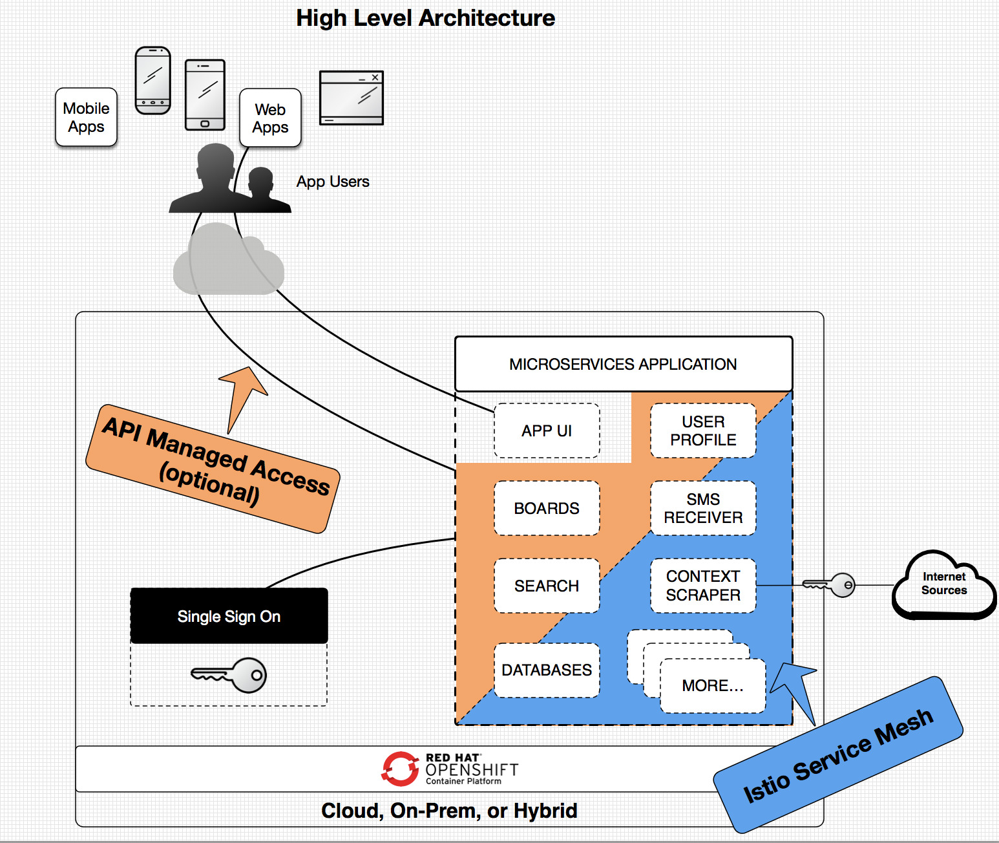
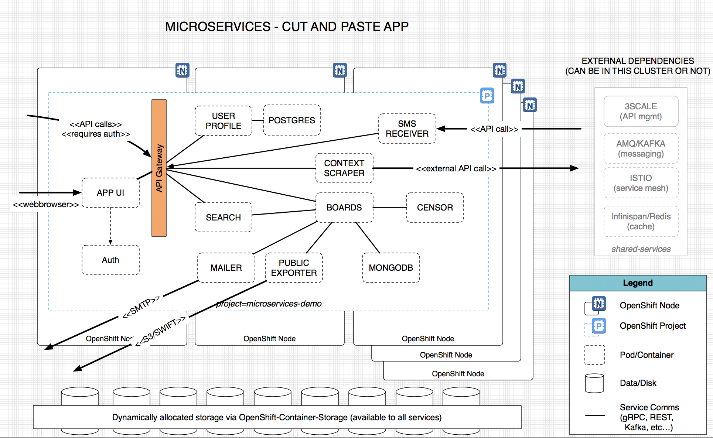

# PLEASE NOTE THIS REPO IS IN-WORK 
## This header will be removed when the initial version is ready for beta usage

# Microservices
Microservices, also known as the microservice architecture, is a software development technique that structures an application as a collection of loosely coupled services. Microservice architectures enable the continuous delivery/deployment of large, complex applications.

This git repo showcases an app built using the microservice architecture with several intentionally simple components. The goal is to showcase an example way to develop and manage microservices using a container platform. However, this example is not meant to be prescriptive - obviously your team and business goals will drive your specific architecture and environment. The technology should translate and hopefully you will find this repo helpful.

## Why microservices?
Agility. Deliver application updates faster. Isolate and fix bugs easier. Done right, a microservices architecture will you help to meet several important non-functional requirements for your software:
* scalability
* performance
* reliability
* resiliency
* extensibility
* availability

## Here's how it's architected:

*In the above diagram web app users are accessing the APP UI service which has all it's calls to the application managed via 3scale. Access to the services from mobile apps also go through the 3scale API management capability. 3scale APIs are secured via a single sign on capability (keycloak in this example). All of this is running on top of an OpenShift cluster. Additional service interactions and deployment details are in other diagrams.*

*The above diagram shows how the services are related and additionally how they are abstracted from the underlying infrastructure (compute and storage) when deployed on top of an OpenShift cluster*

###### :information_source: This example is based on OpenShift Container Platform version 3.11.  It should work with other versions but has not been tested.

## How to run this?
First off, you need access to an OpenShift cluster. Don't have an OpenShift cluster? That's OK, download the CDK (or minishift) for free here: https://developers.redhat.com/products/cdk/overview/. You will need a fairly beefy machine to run *everything* on the same machine via CDK, so I'd recommend you expose extra CPUs and Mem to the CDK when you start your cluster.

Once you're logged into the cluster with oc...
 - TBD steps to run

Now that you have the basic app up and running, how about trying out [some demos](./deployment/demos)

## About the code / software architecture
The parts in action here are:
* A set of microservices that together provide full application capability for a cut and paste board (in code folder)
* Key platform components that enable this example:
    * container building via s2i
    * service load balancing
    * service autoscaling
    * service health checks and recovery
    * dynamic storage allocation and persistent volume mapping
    * Kubernetes operators to manage middleware components (e.g. Kafka)
* Middleware components in this example:
    * API management and metrics (on the external facing services)
    * authorization and ingress security via SSO
    * Kafka for user activity tracking and streaming
    * advanced service management via a service mesh (optional)

## References, useful links, good videos to check out
* [Mastering Chaos Netflix Talk](https://youtu.be/CZ3wIuvmHeM)
* [Red Hat Developer's Learning - Microservices](https://developers.redhat.com/learn/microservices/)
* [What is Istio?](https://istio.io/docs/concepts/what-is-istio/)
* [Keycloak SSO](https://www.keycloak.org/)

## Contributing
[See guidelines here](./CONTRIBUTING.md). But in general I would love for help with 2 things.
1. Use this repo and [report issues][1], even fix them if you can.
2. Have [discussions][2] on topics related to this repo. Things like "Securing services", or "Microservices vs SOA"... 
   - currently doing this in issues (and tagging them as a `discussion`).

## License
Apache 2.0.

[1]: https://github.com/dudash/openshift-microservices/issues
[2]: https://github.com/dudash/openshift-microservices/labels/discussion